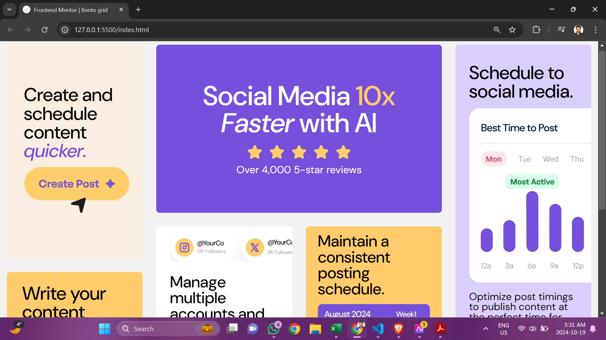
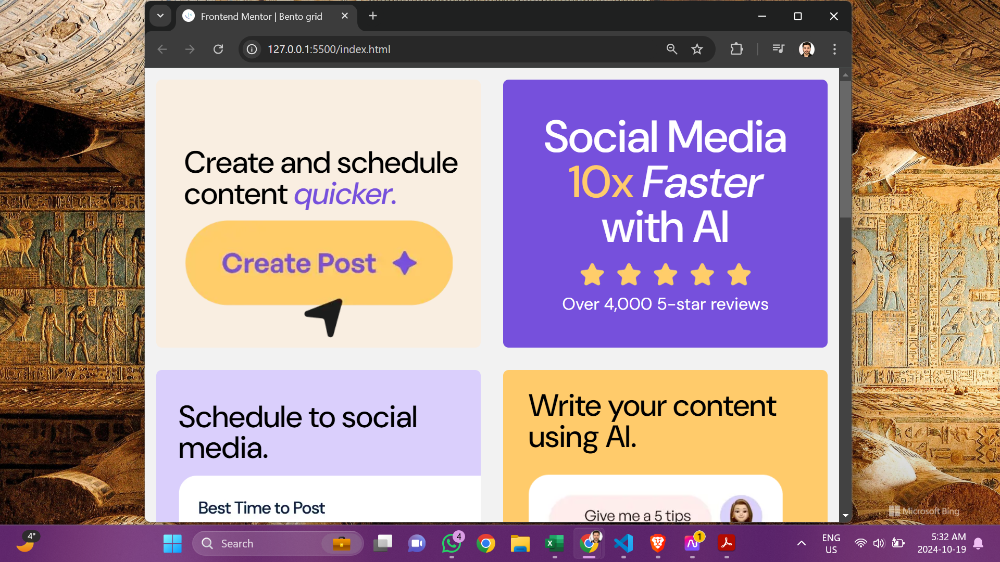

# Frontend Mentor - QR code component solution

This is a solution to the [Bento grid challenge on Frontend Mentor](https://www.frontendmentor.io/challenges/bento-grid-RMydElrlOj). Frontend Mentor challenges help you improve your coding skills by building realistic projects. 

## Table of contents

- [Overview](#overview)
  - [Screenshot](#screenshot)
  - [Links](#links)
- [My process](#my-process)
  - [Built with](#built-with)
  - [What I learned](#what-i-learned)
- [Author](#author)
- [Acknowledgments](#acknowledgments)

## Overview

### Screenshot

The above are the screenshots of desktop version

The above are the screenshots of tablet version

The above is the screenshot of mobile(iphone 14 pro) version

### Links

- Live Site URL: [https://ajeeshakshay.github.io/bento-grid/]

## My process

### Built with

- Semantic HTML5 markup
- CSS custom properties
- Flexbox
- CSS Grid
- CSS media queries

### What I learned

After 2 projects of failing with making te web page responsive, I was able to make this responsive. I have made a tablet and mobile version too along with the desktop version.

I depended mostly on Youtube for the exact measurements of padding, margins and font size. I also want to correct the responsiveness on my webpages. 

Saw how much a gap in container could effect the total look. Was able to understand if something looks a bit off at any particular place of the final version

## Author

- Github - [Akshay Ajeesh](https://github.com/ajeeshakshay)
- Frontend Mentor - [@ajeeshakshay](https://www.frontendmentor.io/profile/ajeeshakshay)

## Acknowledgments

- Youtube - [Bento Grid | Frontend Mentor Challenge (HTML & CSS)](https://www.youtube.com/watch?v=-muwduB2G1A)